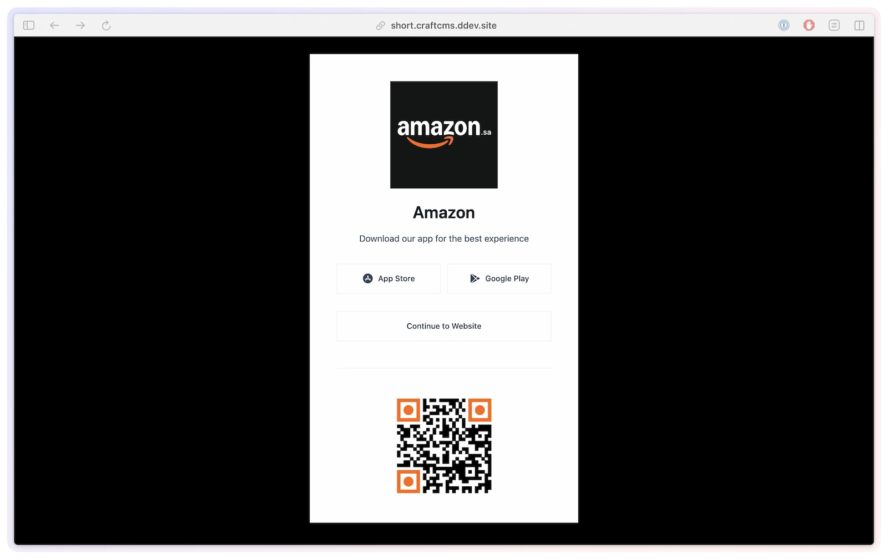

# Custom templates

SmartLink Manager renders two front-end pages — the redirect page and the QR code page. Each ships with a default template you can override in your own site to control the markup, branding, and behavior. You only need to override the ones you want to change; anything left at its default keeps working.

## Overridable templates

| Template | Default path | Setting | What it renders |
|----------|--------------|---------|-----------------|
| `redirect.twig` | `smartlink-manager/redirect` | `redirectTemplate` | The smart link landing/redirect page. Detects the visitor's platform, fires analytics/SEOmatic tracking, and either auto-forwards or shows platform buttons that link to the tracked `goUrls`. |
| `qr.twig` | `smartlink-manager/qr` | `qrTemplate` | The QR code display page at `/{qrPrefix}/{slug}/view`. |

## Where to find and copy them

The reference templates ship inside the plugin. The setup command copies any missing starter templates into the paths configured in settings:

```bash title="PHP"
php craft smartlink-manager/setup/copy-templates
```

```bash title="DDEV"
ddev craft smartlink-manager/setup/copy-templates
```

Use `--template=redirect` or `--template=qr` to copy one template, and `--overwrite` when you intentionally want to replace an existing destination.

You can also copy files manually:

**Redirect / landing page**

```bash
cp vendor/lindemannrock/craft-smartlink-manager/src/templates/redirect.twig templates/smartlink-manager/redirect.twig
```

**QR code page**

```bash
cp vendor/lindemannrock/craft-smartlink-manager/src/templates/qr.twig templates/smartlink-manager/qr.twig
```

Once a file exists at `templates/smartlink-manager/{name}.twig`, the default path resolves to it automatically — no setting change is needed. The path **settings** only matter if you want the template somewhere else:

- Set `redirectTemplate` / `qrTemplate` in **Settings → SmartLink Manager** (or `config/smartlink-manager.php`) to point at a different template path.
- Leave a setting empty to use the default path shown above.
- Each path field accepts a `$ENV_VAR` in the Control Panel, or `App::env()` in the config file.
- A value in `config/smartlink-manager.php` overrides the Control Panel field (the CP field is shown disabled with an override warning).

The CP tells you whether the files are in place: **Settings → General → Template Settings** shows a live status box ("All required frontend templates are available." or a warning pointing you to setup), and the **Setup** page lists each template as Ready or Missing with its resolved destination path.

See [Configuration → Template settings](../get-started/configuration.md) for the settings reference.

## Available variables

Each template receives a fixed set of variables from the plugin. Use these instead of querying for the link yourself.

### `redirect.twig`

The default template renders a platform-aware landing page — app-store buttons for the visitor's device, a *Continue to Website* link, and the QR code:



It receives these variables:

| Variable | Type | Description |
|----------|------|-------------|
| `smartLink` | `SmartLink` | The resolved smart link element. |
| `device` | `DeviceInfo` | Detected device/platform details for the request (the detected language is available as `device.language`). |
| `goUrls` | `array` | Per-platform tracked URLs for buttons (e.g. `goUrls.ios`, `goUrls.android`, `goUrls.fallback`). |
| `source` | `string` | `direct` or `qr`. |

The element also exposes:

- `smartLink.renderRedirectSeomaticTracking()` — [SEOmatic](integrations.md) data-layer tracking for the landing page.
- `smartLink.renderRedirectScript()` @since(5.33.0) — the **cache-safe auto-redirect** script (see [below](#cache-safe-auto-redirect)).

For the full redirect-template walkthrough (platform buttons, tracked hops), see [Device detection](../feature-tour/device-detection.md) and [Smart links](../feature-tour/smart-links.md).

```twig
{# templates/smartlink-manager/redirect.twig #}
<!DOCTYPE html>
<html>
<head>
    {{ smartLink.renderRedirectSeomaticTracking()|raw }}
</head>
<body>
    <p>Choose a store, or wait while we check your device.</p>

    <a href="{{ goUrls.ios }}">iOS</a>
    <a href="{{ goUrls.android }}">Android</a>
    <a href="{{ goUrls.fallback }}">Other</a>

    {# Cache-safe auto-redirect (resolves the device-specific destination at request time) #}
    {{ smartLink.renderRedirectScript() }}
</body>
</html>
```

#### Cache-safe auto-redirect

The landing page is platform-aware, so the auto-forward **must not** be baked into the HTML — if a CDN or static cache served a page that hard-coded one platform's tracked URL, every later visitor would be sent to the wrong store. `renderRedirectScript()` avoids this: it outputs a small script that, on each load, fetches a **no-store** server-side resolver which returns the correct auto-forward URL for *that* request, then forwards. So the cached HTML stays generic and the redirect decision is always resolved fresh.

- Use `renderRedirectScript()` for the auto-forward; do not write your own template-level auto redirect.
- The per-platform **buttons** still use the tracked `goUrls` values (those record the click via the tracked `smartlink-manager/redirect/go` action).
- Keep request-specific redirect decisions out of Twig conditionals. Use neutral page copy such as "Choose a store, or wait while we check your device" so statically cached HTML remains valid for every visitor.

> [!TIP]
> **Debugging the redirect.** Two behaviors, depending on how you call the helper:
>
> - `{{ smartLink.renderRedirectScript() }}` — default, safe. `?debug=1` is honored **only in `devMode`**; on staging/production it does nothing and the auto-forward runs normally.
> - `{{ smartLink.renderRedirectScript(true) }}` — opt-in override (custom templates only). Allows `?debug=1` **even with `devMode` off**, so you can stop the auto-forward on staging and log the resolver URL in the browser console. Use it intentionally for staging validation and revert it for production.
>
> When you can't (or don't want to) enable debug — e.g. the shipped template on production — diagnose from the response headers instead. See [Troubleshooting](../resources/troubleshooting.md).

### `qr.twig`

| Variable | Type | Description |
|----------|------|-------------|
| `smartLink` | `SmartLink` | The smart link the QR code points to. |
| `size` | `int` | Requested QR size in pixels. |
| `format` | `string` | `png` or `svg`. |
| `qrCodeData` | `string` | Base64-encoded PNG data (present when `format` is `png`). |
| `qrCodeSvg` | `string` | Raw SVG markup (present when `format` is `svg`). |

```twig

    {{ qrCodeSvg|raw }}

    

```

## What to customize (and what to keep)

- **Customize freely:** layout, branding, copy, styling, the platform-button design, the redirect delay, and any extra markup or analytics you want on the page.
- **Keep on the redirect page:** the `goUrls` button links, `renderRedirectScript()`, and `renderRedirectSeomaticTracking()` if you use SEOmatic. Replacing them with `smartLink.getRedirectUrl()` skips tracking.
- Redirect templates are standalone pages by default. You can `` your own layout if you prefer, but a minimal page generally redirects faster.

## Related

- [Configuration → Template settings](../get-started/configuration.md)
- [Device detection](../feature-tour/device-detection.md) — platform routing and the redirect flow
- [QR codes](../feature-tour/qr-codes.md)
- [SEOmatic integration](integrations.md)
