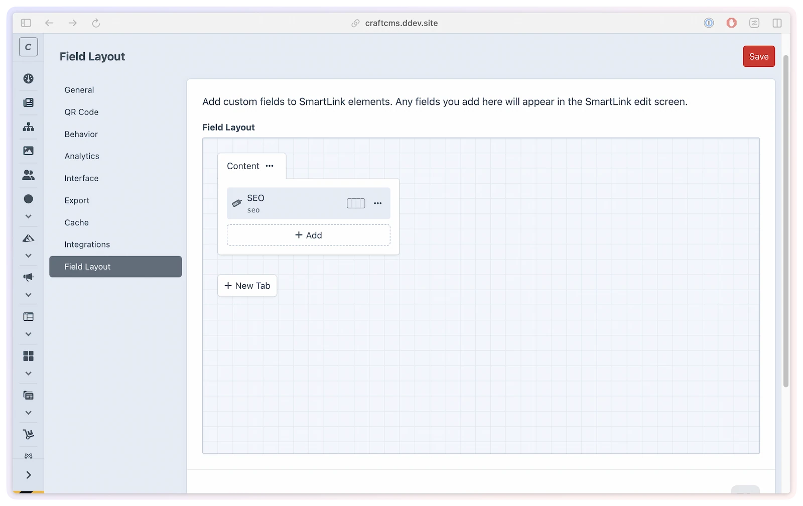

# Field layout

Add project-specific metadata directly to SmartLink elements, without changing templates or creating a separate entry type. Field layouts let editors manage the extra information your team needs beside each smart link.

Use this when the smart link itself needs fields like campaign owner, app version, launch checklist, approval status, notes for support teams, or reporting tags.

## What you'll use it for

- **Campaign metadata** — keep owner, launch, and approval details beside the link that powers the campaign.
- **App release coordination** — record store-review status, app version, rollout phase, or internal notes on each smart link.
- **Operational handoff** — add fields that help support, marketing, or analytics teams understand why a link exists.
- **Template output** — expose custom field values on the SmartLink element so your templates can render them where needed.

## Add fields to SmartLink elements

Go to **SmartLink Manager → Settings → Field Layout**.



Add any Craft fields you want SmartLink elements to carry. When a field-layout tab contains fields, it appears as an extra tab on the SmartLink edit screen.

Empty field-layout tabs are skipped on the edit screen, so a placeholder tab with no fields will not create an empty tab for editors.

## Field layout vs SmartLink Field

These two features solve different problems:

| Feature | Use it when |
|---------|-------------|
| **Field layout** | You want to add custom fields directly to SmartLink elements |
| **SmartLink Field** | You want entries or other elements to select one or more SmartLink elements |

If the data belongs to the smart link itself, use the field layout. If another element needs to reference a smart link, use the [SmartLink Field](smartlink-field.md).

## Project config behavior

Field layouts are Craft project-config changes. That means they should be changed in development and deployed through your normal project-config workflow.

When `allowAdminChanges` is disabled, the Field Layout settings page is read-only. The normal SmartLink Manager settings remain database-backed and editable from the CP unless a setting is locked by `config/smartlink-manager.php`.

## Template access

Custom fields are available on the SmartLink element like any other Craft element field:

```twig



    <p>Owner: {{ link.campaignOwner }}</p>

```

Use the handle you configured on the Craft field.

## Limitations

- Field-layout changes require an environment where Craft admin changes are allowed.
- Tabs without fields are not shown on SmartLink edit screens.
- This feature does not replace the SmartLink Field picker for entries and other elements.
