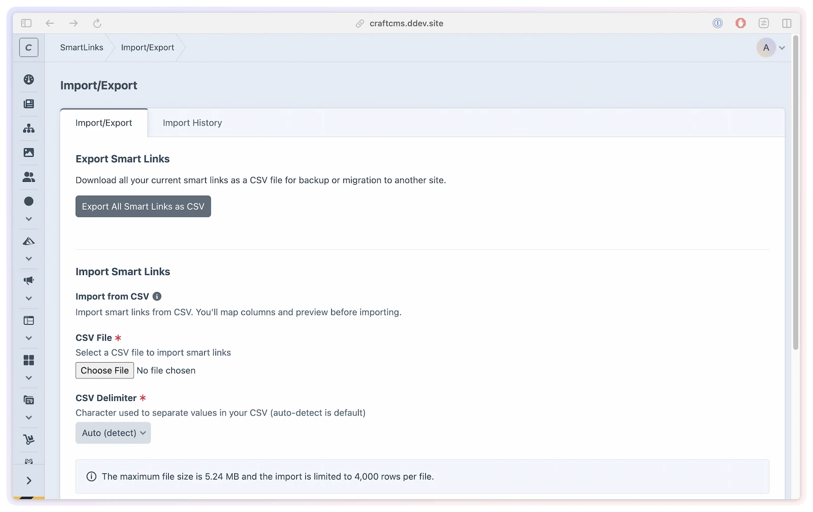
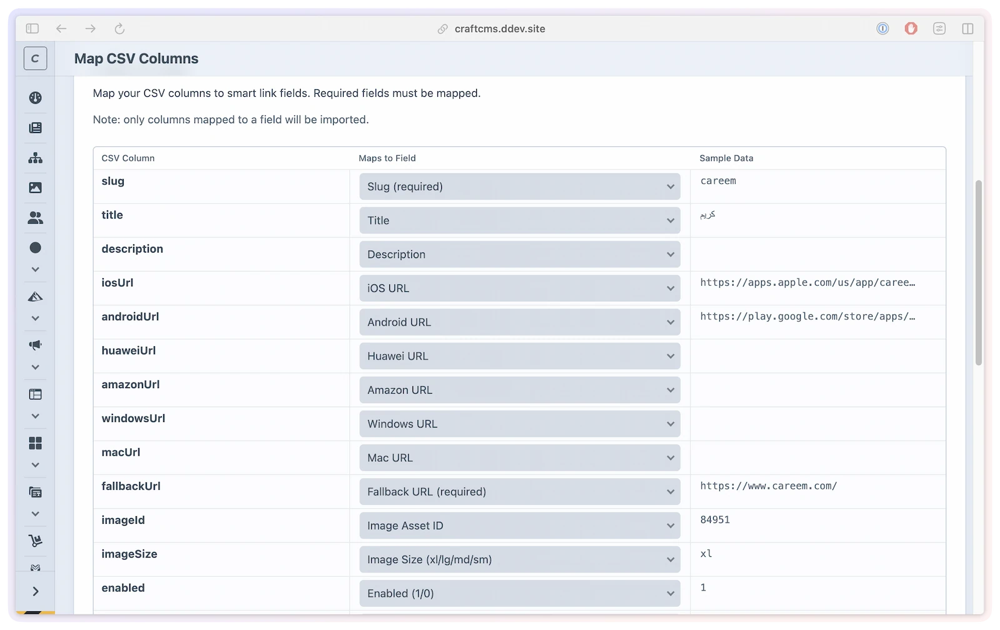
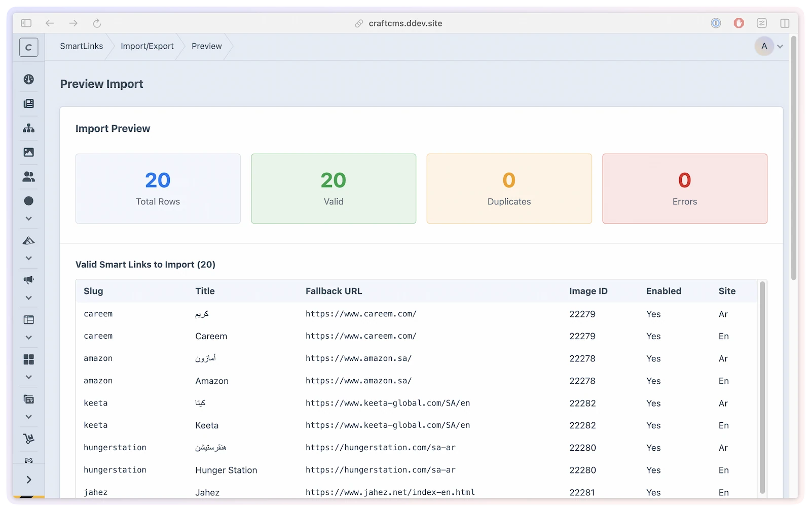

# Import & Export

Move smart links in bulk using CSV. Export your whole library to edit offline or back it up, and import a CSV to create many links at once — useful when migrating from another system or setting up a new site.

## What you'll use it for

- **Bulk setup** — create dozens or hundreds of links at once from a spreadsheet instead of one at a time.
- **Migrations** — bring links over from another tool by mapping its CSV columns to smart link fields.
- **Backups** — export your whole library to a single timestamped CSV you can archive or edit offline.
- **Round-tripping** — export, edit the rows in a spreadsheet, and re-import to update in bulk.

## Access

Go to **SmartLink Manager → Import/Export**. The page shows up to three sections depending on your permissions:

- **Export** — download your smart links as a CSV file
- **Import** — upload a CSV and map its columns to smart link fields
- **Import History** — a log of past imports

## Exporting

Click **Export CSV** to download your smart links as a single CSV with a timestamped filename. The export covers every site that is enabled for the plugin *and* that you have edit access to (Craft's native "Edit site" permission) — on multi-site installs, links on sites you can't edit are left out. If no sites qualify, the page shows "No smart links to export." The file contains one column per smart link field:

| Column | Description |
|--------|-------------|
| `slug` | The link's unique slug |
| `title` | Display title |
| `description` | Optional description |
| `iosUrl` | iOS destination URL |
| `androidUrl` | Android destination URL |
| `huaweiUrl` | Huawei destination URL |
| `amazonUrl` | Amazon Appstore destination URL |
| `windowsUrl` | Windows destination URL |
| `macUrl` | macOS destination URL |
| `fallbackUrl` | URL used when no platform-specific URL matches |
| `imageId` | Asset ID for the link's image (empty if none) |
| `imageSize` | Image display size (e.g. `xl`) |
| `enabled` | `1` or `0` |
| `siteId` | Numeric site ID |
| `siteHandle` | Site handle (e.g. `default`) |
| `trackAnalytics` | `1` or `0` |
| `qrCodeEnabled` | `1` or `0` |
| `qrCodeSize` | QR size in pixels |
| `qrCodeColor` | Foreground color (hex) |
| `qrCodeBgColor` | Background color (hex) |
| `qrCodeEyeColor` | Eye color override (hex, empty to use `qrCodeColor`) |
| `qrCodeFormat` | `png` or `svg` |
| `qrLogoId` | Asset ID for the QR logo (empty if none) |
| `hideTitle` | `1` or `0` |
| `postDate` | Post date |
| `dateExpired` | Expiry date (empty if not set) |

The export is also the canonical template for imports — export once, edit the rows, and re-import.

## Importing

Import is a four-step wizard.

### 1. Upload

Select your CSV and click **Upload**. The importer accepts UTF-8 CSV files up to **4,000 rows** and **5 MB**. The delimiter (comma, semicolon, or tab) is auto-detected, or you can set it manually.

### 2. Map columns

A preview of your file appears with a dropdown per column. Map each column to a smart link field. **`slug` is required** — every other field is optional, and unmapped columns are ignored.

### 3. Preview

Review what will happen before committing. Rows are sorted into:

- **Valid** — will be imported
- **Duplicates** — the slug already exists, or appears more than once in the file (skipped)
- **Errors** — failed validation, e.g. a missing slug or fallback URL, or an invalid URL (skipped)

### 4. Import

Confirm to create the smart links. A summary shows how many were imported and how many were skipped, and the run is added to the import history.

## Multi-site imports

To target a specific site, map a `siteId` or `siteHandle` column; if both are present, `siteHandle` wins. If neither is mapped, links are created on the current site.

To create the same slug on more than one site, include one row per site with the same `slug` and different `siteId`/`siteHandle` values — the importer attaches each as a site variant of the same link.

Rows are also permission-checked per site — see the "Site must be importable" rule below and [Permissions → Multisite](../developers/permissions.md#multisite-the-native-editsite-permission).

## Import validation rules

| Rule | Detail |
|------|--------|
| `slug` required | Rows with an empty slug after normalization are skipped |
| Slug normalized | Slugs are lowercased and cleaned to a valid format |
| Unique slug | Slugs already in the database, or repeated within the file, are skipped as duplicates |
| `fallbackUrl` required | Rows without a fallback URL are skipped |
| URL format | `fallbackUrl` and any platform URLs must be valid URLs |
| Safe content | Rows whose title or description contain markup that could be unsafe are skipped |
| `qrCodeSize` | Clamped to 100–1000 pixels |
| Boolean columns | `enabled`, `trackAnalytics`, `qrCodeEnabled`, `hideTitle` accept truthy/falsy values (e.g. `1`/`0`) |
| Site must be importable | The target site must be enabled for the plugin and editable by you (multi-site) — otherwise the row fails. This check runs at the final import step, so it isn't reflected in the preview counts |

If `title` is left empty, the slug is used as the title.

## Import history

The **Import History** table lists the last 20 imports with the date, the user who ran it, the original filename and size, and the number of links imported and failed. Click **Clear History** to remove all records.

## Permissions

| Permission | Grants |
|------------|--------|
| `smartLinkManager:manageImportExport` | Access the Import/Export section |
| `smartLinkManager:exportLinks` | Download the CSV export |
| `smartLinkManager:importLinks` | Upload and run imports |
| `smartLinkManager:clearImportHistory` | Clear the import history |

See [Permissions](../developers/permissions.md) for the full hierarchy.
