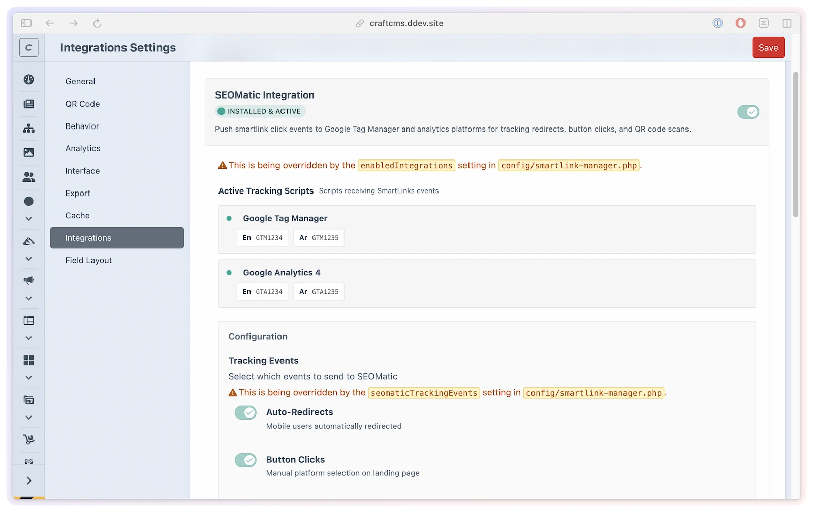

# Integrations

SmartLink Manager integrates with SEOmatic, Redirect Manager, and Craft Link Field. Each integration is optional and can be enabled or disabled in **Settings → Integrations**.

## What you'll use it for

- **Tag-manager tracking** — push smart link interactions into the GTM/GA4 data layer through SEOmatic.
- **No broken links on slug changes** — let Redirect Manager create an automatic 301 when a smart link's slug changes.
- **Native field picking** — offer SmartLink as a type in Craft's Link field so editors can pick one inline.



## SEOmatic Integration

When SEOmatic is installed and the integration is enabled, SmartLink Manager registers SmartLinks as a SEOmatic content source and pushes structured data layer events to the GTM/GA4 data layer for QR-tagged arrivals, automatic onward navigation, and manual platform choices.

### Event Types

Three event types are dispatched to the data layer:

| Event Name | When It Fires |
|------------|--------------|
| `smart_links_redirect` | Automatic onward navigation starts, immediately before leaving the landing page |
| `smart_links_qr_scan` | A visitor arrives at the landing URL with `?src=qr` |
| `smart_links_button_click` | A visitor clicks a tracked platform or fallback button on the landing page |

The `smart_links_` prefix is configurable via the `seomaticEventPrefix` setting (default `smart_links`) — if you change it, the event names change to match (e.g. `myapp_redirect`).

### Data Layer Structure

Tracking is pushed **client-side** from the rendered landing page. A redirect event pushes this payload:

```json
{
    "event": "smart_links_redirect",
    "smart_link": {
        "slug": "my-app",
        "title": "My App",
        "platform": "auto",
        "source": "direct",
        "click_type": "redirect"
    }
}
```

Each event switch works independently. A desktop landing page or a paused redirect emits no `_redirect`. A QR-tagged arrival can emit `_qr_scan` followed by `_redirect` if automatic navigation starts, or `_button_click` if the visitor chooses a button. Displaying or downloading a QR image emits no scan event. The QR marker records attribution; manually opening the same tagged URL has the same effect as scanning it.

QR scan events use `source: "qr"` and `click_type: "qr_scan"`. Automatic redirects keep `platform: "auto"`. Button-click events use `click_type: "button_click"` and include the clicked platform, read from the tracked action URL's `?platform=` parameter or path, falling back to `unknown` when neither supplies it. Public URL prefixes and custom domains do not change the event names.

These events mark actions on the landing page, not confirmed destination loads. A data-layer push also does not confirm GA4 delivery: configure GTM to forward the selected events, and verify receipt in GA4. Use your existing SEOmatic/Google page-view tracking for page views; SmartLink Manager adds no separate view event.

### Configuration

Enable the integration in **Settings → Integrations → SEOmatic**. The integration is automatically detected. (When SEOmatic isn't installed, see [Integration requirements](#integration-requirements) below for what the card shows.)

### Content SEO and sitemaps

When the integration is enabled, SEOmatic adds a **SmartLinks** source (named after the plugin's display name) in **SEOmatic → Content SEO**. That source lets you manage the SEOmatic metadata bundle for rendered smart link and QR pages, including title, robots, canonical URL, and sitemap settings.

SmartLink Manager sets these defaults:

| Setting | Default |
|---------|---------|
| SEO Title | From the SmartLink title |
| Canonical URL | The smart link's public URL |
| Robots | `all` |
| Sitemap URLs | Off |

If you enable sitemap URLs in SEOmatic, the generated sitemap URLs use the same public URL builder as smart links and QR codes. That means `smartlinkBaseUrl`, custom domains, and multisite tokens such as `{siteHandle}`, `{siteId}`, and `{siteUid}` are respected.

SEOmatic only lists actual Craft field-layout fields as **Source Field** options. Native SmartLink properties such as the built-in description and image are not listed there. To manage SEO descriptions or images for smart links, use one of these approaches:

- Add a SEOmatic SEO field to the SmartLink field layout and edit metadata per smart link.
- Add your own text/asset fields to the SmartLink field layout, then map those fields in SEOmatic Content SEO.

Existing SEOmatic content bundles keep their saved settings. If you enabled the integration before changing defaults, resave or reset the SmartLinks source in SEOmatic to apply the current defaults.

### Tracking in custom templates

Keep both helpers on the landing page: `renderRedirectSeomaticTracking()` installs event tracking, and `renderRedirectScript()` resolves the device-specific destination and starts automatic navigation. Button links must use the controller-provided tracked URLs:

```twig
{{ smartLink.renderRedirectSeomaticTracking() }}
<a href="{{ goUrls.ios }}">Download for iOS</a>
<a href="{{ goUrls.fallback }}">Continue to website</a>
{{ smartLink.renderRedirectScript() }}
```

The tracking helper returns a `<script>` block, so place it outside an HTML tag's attributes. Render it once per page, before the redirect script. The legacy `renderSeomaticTracking('redirect')` call remains equivalent. QR display templates need no tracking helper; existing `renderQrSeomaticTracking()` and `renderSeomaticTracking('qr_scan')` calls remain callable but return nothing.

See [Custom templates](../developers/custom-templates.md) for the complete landing-page example and the supported debug pause.

## Redirect Manager Integration

When Redirect Manager is installed and the integration is enabled, SmartLink Manager automatically creates a 301 redirect whenever a smart link's slug is changed.

### How It Works

1. You edit a smart link and change its slug from `my-app` to `my-app-v2`
2. SmartLink Manager detects the slug change on save
3. A 301 redirect is registered in Redirect Manager: `/go/my-app` → `/go/my-app-v2`
4. Any existing links or QR codes using the old slug continue to work

This prevents broken links when you need to rename or reorganize your smart links.

### Configuration

Enable the integration in **Settings → Integrations → Redirect Manager**. The integration requires Redirect Manager to be installed.

> [!NOTE]
> The redirect is created using the `slugPrefix` setting. If you change the prefix, existing redirects created under the old prefix will still point to the old prefix path.

### Fallback lookup

When a visitor hits a smart link **landing URL** whose slug no longer resolves (the smart link was deleted or renamed), SmartLink Manager checks Redirect Manager for a matching redirect before falling back to `notFoundRedirectUrl`. This keeps old bookmarks and QR codes working after a slug change even if no automatic redirect was created.

This applies to unresolved **landing** smart-link URLs. Tracking-hop URLs (the `smartlink-manager/redirect/go` action) go straight to the configured 404 when they fail — they are not routed through Redirect Manager.

## Craft Link Field Integration

SmartLink Manager registers itself as a link type option for Craft's native [Link field](https://craftcms.com/docs/5.x/reference/field-types/link.html) (available in Craft CMS 5.3+).

Users can select a **SmartLink** as the link target in any Link field — anywhere a URL, entry, category, or asset would normally appear.

### Value Format

When a Link field contains a SmartLink selection, the field value resolves to the smart link's public redirect URL (`/{slugPrefix}/{slug}`), so it works transparently in templates:

```twig
{# In a matrix block with a Link field named 'ctaLink' #}
<a href="{{ block.ctaLink.url }}">{{ block.ctaLink.text }}</a>
```

If the smart link is disabled or expired, the URL returns `null` — the same behavior as a disabled entry in a Link field.

### SmartLinkType

The `SmartLinkType` class is registered automatically when Link Field is installed. There is no additional configuration required.

## Servd static cache

When the [Servd Asset Storage](https://plugins.craftcms.com/servd-asset-storage) plugin is installed and enabled, SmartLink Manager automatically purges Servd's static cache for the affected URLs whenever a smart link changes — there's no settings toggle to turn it on.

- **What's purged:** the public smart link URL and the QR landing URL, across all enabled sites (generated with `Settings::buildPublicUrl()`, so `smartlinkBaseUrl`, custom domains, and `{siteHandle}` tokens are respected).
- **When:** on save/update, before delete, after a slug change (the old slug is purged too), and when SmartLink Manager caches are cleared.
- **Prerequisites:** purging only runs on Servd's hosting infrastructure with static cache enabled — the PHP `redis` extension must be loaded, Servd's runtime environment variables (`SERVD_CACHE_ENABLED`, `REDIS_HOST`, `REDIS_PORT`, `REDIS_STATIC_CACHE_DB`, `SERVD_PROJECT_SLUG`) must be present, and `ENVIRONMENT` must be exactly `development`, `staging`, or `production`. On a standard Servd deployment these are already set; anywhere else the purge is silently skipped.

This keeps Servd from serving stale redirect/QR landing responses after a change. See [Troubleshooting](../resources/troubleshooting.md).

## Integration Requirements

| Integration | Required Plugin |
|-------------|----------------|
| SEOmatic | `nystudio107/craft-seomatic` |
| Redirect Manager | `lindemannrock/craft-redirect-manager` |
| Craft Link Field | Craft CMS 5.3+ (native Link field) |
| Servd static cache | `servd/craft-asset-storage` (optional — auto-detected; Servd hosting only) |

All integrations are detected automatically. If the required plugin is not installed, its card still shows with an **Install Plugin** link but the enable toggle is disabled, and no integration code runs until it is installed and enabled.

For the `IntegrationInterface` API reference, see [Integrations API](../developers/integrations.md).
