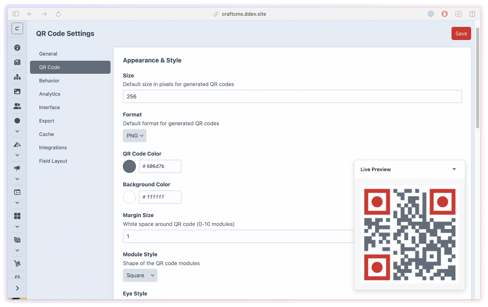

# QR Codes

Every smart link in SmartLink Manager can have a QR code. Each QR code encodes the smart link's public URL, so if you update the destination, the QR code continues working without reprinting. Scanning triggers the same redirect flow as clicking — including analytics tracking.

## What you'll use it for

- **Print and packaging** — put a scannable code on flyers, posters, business cards, or product boxes that always points to the current destination.
- **On-brand codes** — match the code to your brand with custom colors, module and eye styles, and a centered logo.
- **Event and signage** — let people open your app or landing page from a screen or banner without typing a URL.
- **Trackable offline campaigns** — every scan is recorded with device and location, so print reach shows up in your analytics.

## How It Works

QR codes are generated dynamically by the `bacon/bacon-qr-code` library and cached to avoid regenerating on every request. Each QR code encodes the smart link's public URL (e.g., `https://example.com/qr/my-app`).

PNG generation follows Craft's effective image driver: Imagick when Craft is using Imagick, or GD when Craft is using GD. Both drivers preserve the configured module shapes, eye shapes, dimensions, margins, and colors. SVG generation uses its own vector backend and does not depend on Craft's raster driver.

When a visitor scans that QR code, the analytics-safe redirect flow is:

1. the QR code opens the smart link's public URL
2. SmartLink renders its normal redirect page if needed
3. navigation passes through the internal `smartlink-manager/redirect/go` action
4. analytics are written there before the final redirect is issued

That internal tracked hop is the important part under browser/CDN/static cache, not the QR image endpoint itself.

When QR code generation is enabled on a smart link, two endpoints become available:

| URL | Returns |
|-----|---------|
| `/{qrPrefix}/{slug}` | Raw QR code image (PNG or SVG) |
| `/{qrPrefix}/{slug}/view` | Display page with title, image, and download button |

Both public endpoints resolve the exact requested Craft site. They return normal not-found behavior unless SmartLink Manager is enabled for that site and the site's link variant is active, available, and QR-enabled. A rejected request does not render or populate the QR cache.

## Enabling QR Codes Per Link

On the smart link edit page, toggle **QR Code Enabled** to activate QR endpoints for that link. When disabled, both endpoints return a 404.

## Customization Options

QR code appearance is set globally in **Settings → QR Codes** and can be overridden per link on the smart link edit page. Per-link values left at `null` inherit from the global defaults. A live preview updates as you change the size, colors, and styles — on both the settings page and the smart link edit page — so you can see the result before saving.



| Option | Type | Default | Description |
|--------|------|---------|-------------|
| `defaultQrSize` | `int` | `256` | Output size in pixels (100–1000) |
| `defaultQrColor` | `string` | `'#000000'` | Module foreground color (hex) |
| `defaultQrBgColor` | `string` | `'#FFFFFF'` | Background color (hex) |
| `defaultQrFormat` | `string` | `'png'` | Output format: `'png'` or `'svg'` |
| `defaultQrMargin` | `int` | `4` | Quiet zone in modules (0–10) |
| `defaultQrErrorCorrection` | `string` | `'M'` | Error correction: `'L'` (7%), `'M'` (15%), `'Q'` (25%), `'H'` (30%) |
| `qrModuleStyle` | `string` | `'square'` | Module shape: `'square'`, `'dots'`, `'rounded'` |
| `qrEyeStyle` | `string` | `'square'` | Finder pattern shape: `'square'`, `'rounded'`, `'pointed'` |
| `qrEyeColor` | `?string` | `null` | Eye color override (hex). Falls back to foreground color |

### Error Correction

The `L`, `M`, `Q`, and `H` levels apply to both PNG and SVG generation. SmartLink Manager defaults to `M` and passes the effective level explicitly to Bacon QR Code rather than relying on the library's fallback.

The `errorCorrection` request option is trimmed and case-insensitive, so `q`, `Q`, and ` Q ` all select `Q`. An invalid request value uses `defaultQrErrorCorrection`; if that configured default is also invalid, SmartLink Manager safely uses `M`.

### Module Styles

| Value | Appearance |
|-------|-----------|
| `square` | Classic square modules (default) |
| `dots` | Circular dots |
| `rounded` | Rounded square corners |

### Eye Styles

| Value | Appearance |
|-------|-----------|
| `square` | Classic square finder pattern (default) |
| `rounded` | Rounded finder pattern |
| `pointed` | Pointed-corner finder pattern |

## Logo Overlay

Enable `enableQrLogo` in settings to add a brand logo to the center of QR codes. When enabled:

- Set a **default logo** (a Craft asset) applied to all QR codes unless overridden per link
- Optionally restrict which asset volume logos can come from (`qrLogoVolumeUid`)
- Control the **logo size** as a percentage of the QR code width (10–30%, default 20%)
- Use a readable JPEG, PNG, or GIF image from a local or remote Craft volume; SmartLink Manager works from Craft's temporary file copy and removes that copy after composition

Logo composition is PNG-only and uses GD after the base PNG has been rendered. A missing, unreadable, corrupt, inaccessible, or unsupported logo is omitted so the endpoint can still return the valid unbranded QR code.

Per-link logo overrides use the `qrLogoId` field on the smart link edit page.

| Setting | Type | Default | Description |
|---------|------|---------|-------------|
| `enableQrLogo` | `bool` | `false` | Enable logo overlay |
| `qrLogoVolumeUid` | `?string` | `null` | Restrict logo selection to this asset volume |
| `defaultQrLogoId` | `?int` | `null` | Default logo asset ID |
| `qrLogoSize` | `int` | `20` | Logo size as percentage of QR code (10–30) |

> [!WARNING]
> A logo reduces the scannable area. `H` (30% recovery) is appropriate for logo-bearing codes, but always test the finished code with representative scanners, print sizes, and materials before publishing it.

## QR Code URLs

QR codes are available at two URL patterns:

| URL | Description |
|-----|-------------|
| `/{qrPrefix}/{slug}` | Raw QR image (PNG or SVG) returned directly |
| `/{qrPrefix}/{slug}/view` | Display page showing the QR code with title and download |

With default settings (`qrPrefix` = `qr`, `slugPrefix` = `go`):

- Image: `https://example.com/qr/my-app`
- Display page: `https://example.com/qr/my-app/view`

When `smartlinkBaseUrl` contains `{siteHandle}`, `{siteId}`, or `{siteUid}`, the same exact site identifier appears in both URLs and is routable. See [Custom Domain](custom-domain.md#multisite-site-aware-urls) for the portability tradeoffs between those tokens.

Public QR image and display URLs always use the link's saved QR configuration. Styling query parameters are deliberately ignored, so public URLs remain canonical and cacheable instead of creating a separate rendered variant for every query string.

For example, `?size=4096&format=svg&color=ff0000` still returns the saved size, format, and colors. Saving different QR settings on the smart link changes the public output normally. The only supported public image option is `download=1`, when downloads are enabled, and that download also uses the saved size and style.

Unsaved styling remains available in the authenticated control panel. The edit-page preview renders at 150px, and its download menu can export the unsaved colors, format, eye style, module style, and logo without changing the saved public code.

## Downloading QR Codes

When `enableQrDownload` is `true` (default), QR codes can be downloaded. The download filename follows the `qrDownloadFilename` pattern with these tokens:

| Token | Replaced with |
|-------|--------------|
| `{slug}` | The smart link's slug |
| `{size}` | The QR code size in pixels |
| `{format}` | The format: `png` or `svg` |

Default pattern: `{slug}-qr-{size}` produces filenames like `my-app-qr-256.png`.

Only `png` and `svg` are accepted as effective formats. An invalid format request falls back to the configured default, and that normalized format controls the generated bytes, response MIME type, filename token, and file extension together.

The authenticated edit-page download menu includes 256px, 512px, 1024px, and 2048px presets. Custom authenticated downloads accept 100–4096px. Saved per-link sizes and the global default remain limited to 100–1000px, and public downloads always use that saved canonical size. The filename's `{size}` token always matches the generated dimensions.

For print work that must scale beyond a fixed pixel size, prefer SVG. It remains sharp at any layout size and avoids creating an unnecessarily large raster file.

## In Templates

The `SmartLink` element provides methods for embedding QR codes in Twig templates:

```twig



    {# Inline data URI — embed directly in  #}
    

    {# URL to the raw QR image #}
    

    {# Link to the QR display page #}
    <a href="{{ link.qrCodeDisplayUrl }}">View QR Code</a>

    {# Base64 data URI for email templates #}
    

```

| Method | Returns | Description |
|--------|---------|-------------|
| `getQrCodeUrl(options)` | `string` | Canonical public raw-image URL; style options are discarded, while `download` remains supported |
| `getQrCodeDataUri(options)` | `string` | Base64 `data:image/...` URI — use for email or inline embedding |
| `getQrCode(options)` | `string` | Raw binary image data (for programmatic use) |
| `getQrCodeDisplayUrl(options)` | `string` | Canonical public `/view` display-page URL; style options are discarded |

The server-side data URI and raw-data methods continue to accept rendering options for trusted application code. Public URL helpers intentionally do not put styling parameters into visitor-facing URLs. When called as properties such as `link.qrCodeUrl`, the public output uses saved per-link values with global defaults as fallbacks.

## The Display Page

The `/{qrPrefix}/{slug}/view` endpoint renders a styled page containing the QR code with context. A custom template can be set via the `qrTemplate` setting. In multisite projects, a `templates/{siteHandle}/...` override wins for its matching site and the global template remains the fallback; Setup uses the same effective setting and Craft resolution rules as the public display route.

For the starter template, copy command, and available variables, see [Custom templates](../developers/custom-templates.md#qrtwig).

The following variables are available in the display template:

| Variable | Type | Description |
|----------|------|-------------|
| `smartLink` | `SmartLink` | The smart link element |
| `size` | `int` | The saved canonical QR code size |
| `format` | `string` | The saved canonical format (`png` or `svg`) |
| `qrCodeData` | `string` | Base64-encoded PNG data (when format is `png`) |
| `qrCodeSvg` | `string` | Raw SVG markup (when format is `svg`) |

## Caching

Generated QR codes are cached to avoid regenerating on every request.

| Setting | Default | Description |
|---------|---------|-------------|
| `enableQrCodeCache` | `true` | Enable QR code caching |
| `qrCodeCacheDuration` | `86400` | Cache TTL in seconds (24 hours) |
| `cacheStorageMethod` | `'file'` | `'file'` (single server), `'redis'` (multi-server), or `'craft'` (Craft application cache) |

Each public smart link has one effective QR cache identity for its saved URL and styling. Saving an effective option produces a fresh canonical output. Authenticated unsaved previews and downloads bypass persistent file, Craft, and Redis QR caches. SmartLink Manager validates cached PNG/SVG output before serving it; an empty, partial, or wrong-format hit is ignored and replaced only after fresh generation succeeds. Cache can be cleared from **Utilities → SmartLink Manager** (requires `smartLinkManager:clearCache` permission).

After upgrading from a version that allowed public styling query parameters, clear the SmartLink Manager QR cache once from **Utilities → SmartLink Manager**. This removes older plugin-owned variants that the canonical public routes no longer reach; it does not require a migration or a general filesystem sweep.

```php
// config/smartlink-manager.php
return [
    'enableQrCodeCache'   => true,
    'qrCodeCacheDuration' => 86400,
    'cacheStorageMethod'  => 'file',
];
```

## Global vs Per-Link Settings

Global QR defaults are set in **Settings → QR Codes**. Per-link overrides are set on the smart link edit page. Any per-link option left `null` inherits from the global setting.

```php
// config/smartlink-manager.php
return [
    'defaultQrSize'             => 400,
    'defaultQrColor'            => '#1a1a2e',
    'defaultQrBgColor'          => '#FFFFFF',
    'defaultQrFormat'           => 'png',
    'qrModuleStyle'             => 'rounded',
    'qrEyeStyle'               => 'rounded',
    'qrEyeColor'               => null,
    'defaultQrMargin'           => 2,
    'defaultQrErrorCorrection'  => 'H',
];
```

## Limitations

- SVG output does not support logo overlays (logos are PNG only)
- The `dots` module style may not scan reliably at very small sizes — use at least 200px
- QR codes always encode the smart link's public redirect URL — the destination URL cannot be encoded directly
