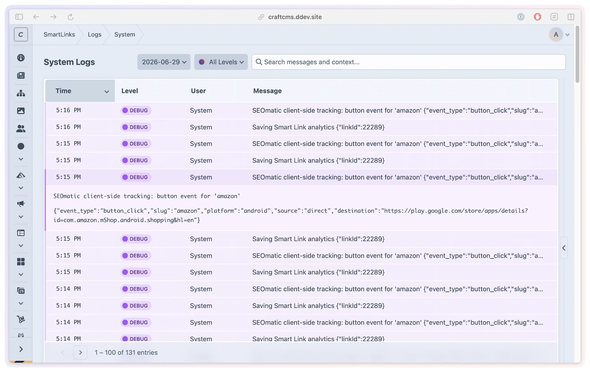

# Logging

SmartLink Manager writes structured, per-day log files through the bundled [Logging Library](https://github.com/LindemannRock/craft-logging-library).

> [!NOTE]
> Logging Library is required by Composer. Install or activate it in Craft to enable log viewing.

```bash title="PHP"
php craft plugin/install logging-library
```

```bash title="DDEV"
ddev craft plugin/install logging-library
```

Or via the Control Panel: **Settings → Plugins → Logging Library → Install**

Use this page when you need to check what SmartLink Manager did: smart link saves, routing, analytics, QR codes, imports, exports, custom domains, device detection, and debug-level diagnostics.

## Log levels

Four log levels are available, in order of verbosity:

| Level | What is logged |
|-------|----------------|
| `error` | Critical errors only |
| `warning` | Errors and warnings |
| `info` | General informational messages |
| `debug` | Detailed debugging, including timing and step-by-step diagnostics |

Each level includes all messages from the levels above it. `error` is the least verbose; `debug` is the most.

> [!WARNING]
> Debug level requires Craft's `devMode` to be enabled. If `logLevel` is set to `debug` while `devMode` is disabled, SmartLink Manager falls back to `info` and records a warning. Use `debug` for local development or short diagnostic sessions, because it can create much more log output.

## Configuration

```php
// config/smartlink-manager.php
return [
    'logLevel' => 'error', // 'error', 'warning', 'info', or 'debug'
];
```

For environment-specific logging, keep production quieter and enable debug only where Craft's `devMode` is enabled:

```php
// config/smartlink-manager.php
return [
    '*' => [
        'logLevel' => 'error',
    ],
    'production' => [
        'logLevel' => 'error',
    ],
    'staging' => [
        'logLevel' => 'warning',
    ],
    'dev' => [
        'logLevel' => 'debug',
    ],
];
```

## Log file location

```text
storage/logs/smartlink-manager-YYYY-MM-DD.log
```

Log files are rotated daily. Retention is managed by Logging Library, with a 30-day default.

Logs are written as structured JSON with context data alongside each message, so they can be searched in the Control Panel or ingested by external logging tools.

## Viewing logs in the CP

The **SmartLink Manager → Logs** screen reads, filters, and downloads these log files without leaving the Control Panel.



From there you can:

- Browse log entries for the current and recent days
- Filter by log level
- Search log messages and context
- View file sizes and entry counts
- Download individual log files for external analysis

The `smartLinkManager:viewSystemLogs` permission is required to access the Logs section. The `smartLinkManager:downloadSystemLogs` sub-permission is required to download log files. In the Craft permissions UI, both are nested under the `smartLinkManager:viewLogs` parent group.

## What gets logged

The level of detail depends on your configured `logLevel`.

### Error (`error`)

- Failed smart link saves or deletes
- Analytics recording failures
- QR code generation failures
- Import or export failures
- Database errors

### Warning (`warning`)

- Invalid or rejected URLs during import
- Custom-domain or routing configuration problems
- Geo-detection provider errors
- Device-detection parsing issues that can continue
- Debug fallback when `logLevel` is set to `debug` without `devMode`

### Info (`info`)

- Smart links created, updated, deleted, or imported
- QR code generation
- Scheduled analytics cleanup
- Import and export runs
- Custom-domain and integration activity

### Debug (`debug`)

- Smart-link resolution decisions
- Cache hit/miss details
- Device detection and geo lookup context
- Analytics payload details
- Performance timing for routing and analytics work

## Developer usage

Most sites only need the configuration and CP viewer above. Custom modules or integrations can write to the same SmartLink Manager log when they need related diagnostics:

```php
use lindemannrock\smartlinkmanager\SmartLinkManager;

SmartLinkManager::getInstance()->logError('Operation failed', [
    'context' => 'import',
    'error' => $e->getMessage(),
]);

SmartLinkManager::getInstance()->logInfo('Smart links exported', [
    'count' => $count,
]);

SmartLinkManager::getInstance()->logDebug('Resolving smart link', [
    'slug' => $slug,
    'siteId' => $siteId,
]);
```

## Permissions

| Action | Permission |
|--------|------------|
| Access the Logs section in the CP | `smartLinkManager:viewSystemLogs` |
| Download log files | `smartLinkManager:downloadSystemLogs` |
| Logs group (parent, Craft permissions UI only) | `smartLinkManager:viewLogs` |

See [Permissions](../developers/permissions.md) for the full permission hierarchy.
